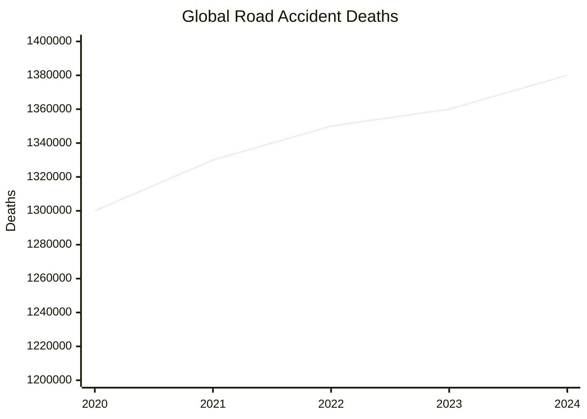
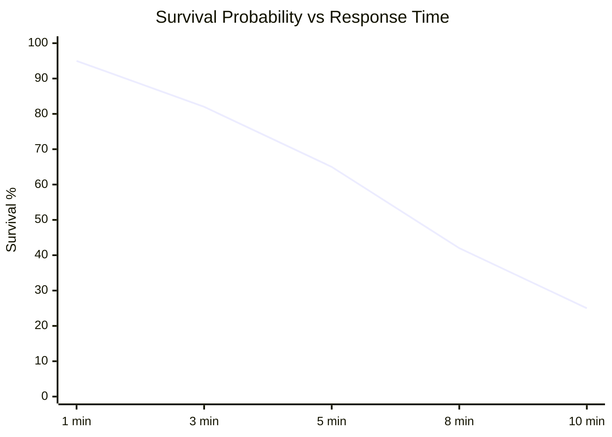
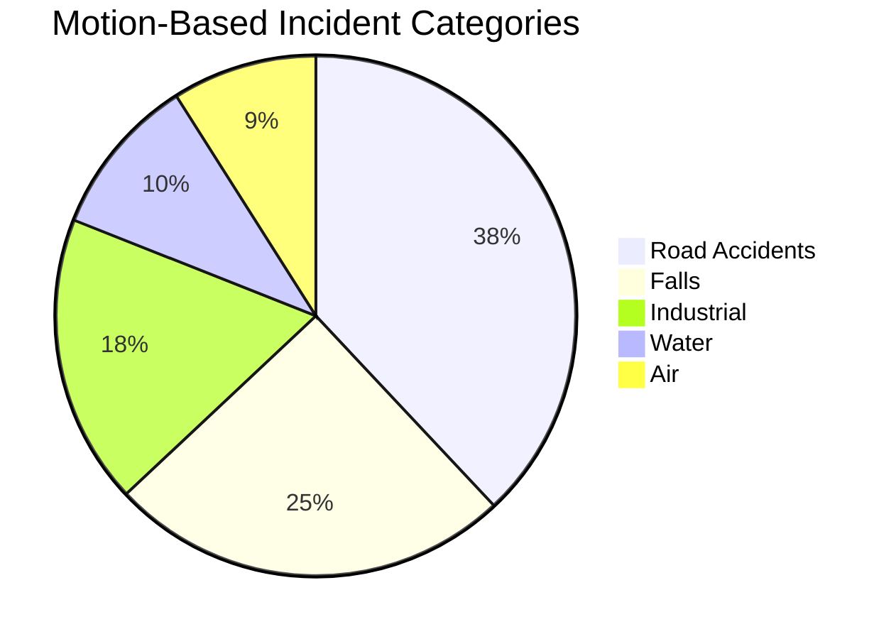
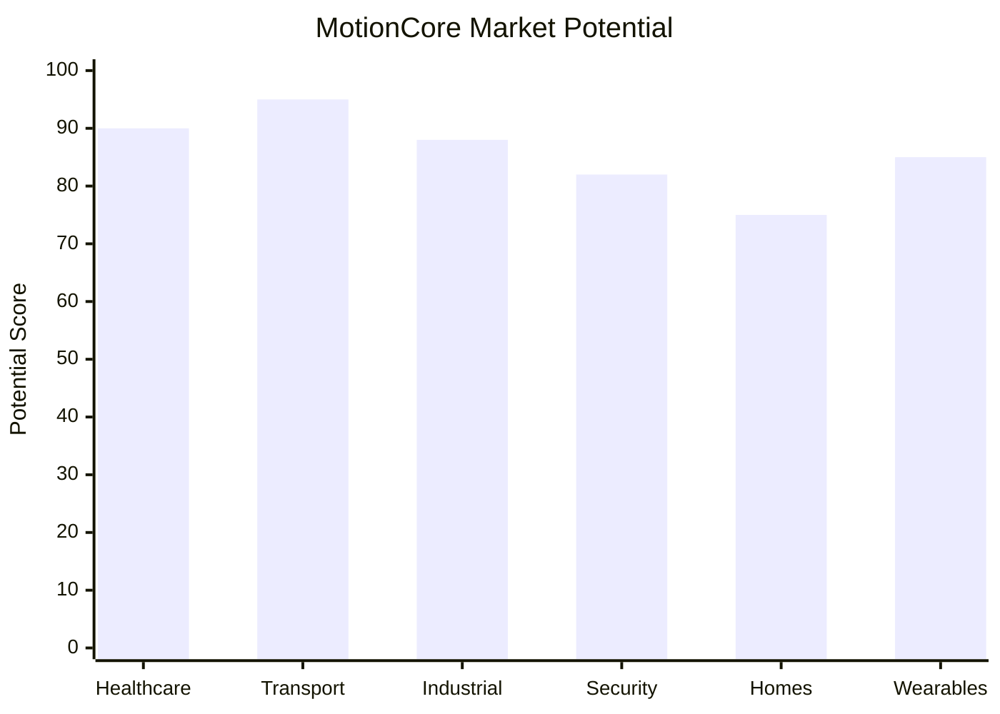
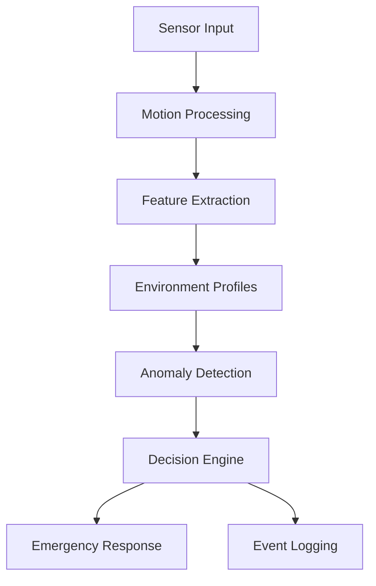
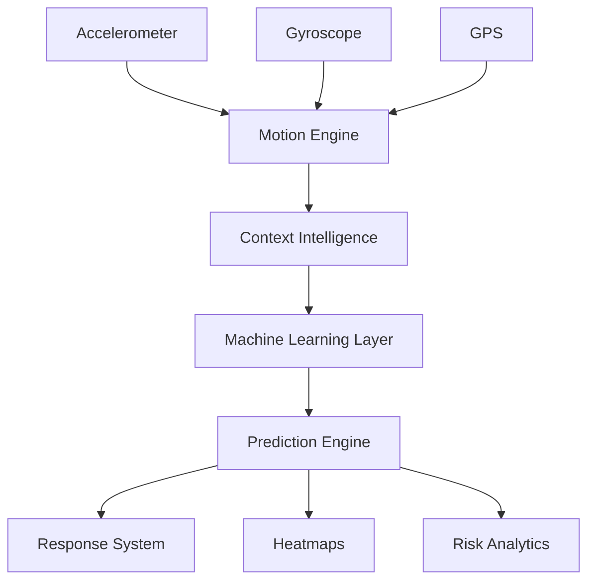

# MotionCore
### Universal Motion Intelligence Infrastructure

---

## Vision

MotionCore is a universal motion intelligence platform designed to detect, analyze, and respond to abnormal physical motion patterns across multiple environments.

Unlike traditional systems that focus only on one use-case, MotionCore creates one adaptive intelligence engine for:

- Human safety
- Road intelligence
- Smart homes
- Industrial safety
- Theft detection
- Air systems
- Water systems

Our goal:

**Prediction. Prevention. Response.**

---

## Problem Statement

Every day millions of physical accidents and motion-related incidents occur worldwide.

Most of them are:

- detected too late
- responded too slowly
- poorly monitored

Current systems are fragmented.

MotionCore aims to unify detection into one scalable infrastructure.

---

# Problem Statistics

---

## Global Road Accident Deaths

Over 1.3 million deaths occur yearly due to road accidents.

---

## Emergency Response Impact

Faster detection can save lives.

---

## Motion-Based Incident Categories

Motion intelligence has wide-scale applications.

---

## MotionCore Application Sectors

Shows where MotionCore can be deployed.

---

# Current Features

- Real-time motion detection
- Environment-aware profiles
- Emergency trigger system
- GPS location capture
- Event logging
- JSON export
- CSV export
- Multi-mode analysis

---

# Current Modes

### Human Safety
Detects:
- idle
- walking
- running
- impact

---

### Road Intelligence
Detects:
- smooth roads
- rough roads
- potholes
- harsh brakes

---

### Security
Detects:
- unauthorized movement
- sudden pickup
- possible theft activity

---

### Smart Home
Can be expanded for:
- intrusion
- inactivity
- unusual movement

---

### Research Mode
For:
- air turbulence
- water instability
- advanced anomaly testing

---

# Motion Parameters Used

MotionCore calculates:

### Mean Motion (M)
Average motion intensity over time.

---

### Peak Motion (P)
Highest force detected.

---

### Variation (V)
Difference between peak and average.

Helps measure stability.

---

# Core Architecture

---

# Future Architecture

---

# Why MotionCore Is Different

Traditional systems:

- single-purpose
- fixed threshold based
- limited adaptability

MotionCore:

- multi-environment
- scalable
- adaptive
- data-driven
- future ML-ready
- location-aware
- exportable datasets

---

# Future Goals

## Phase 1
Dataset collection

Goal:
- improve accuracy
- calibrate thresholds
- collect real-world data

---

## Phase 2
Machine Learning integration

Planned models:

- SVM
- Random Forest
- Decision Trees
- Anomaly Detection

---

## Phase 3
Deployment

Platforms:

- Phones
- Smartwatches
- Vehicles
- IoT devices
- Smart homes
- Industrial wearables

---

# Long-Term Goal

MotionCore is not just an app.

It is being developed as:

**Universal Motion Intelligence Infrastructure**

Potential future systems:

- smart cities
- road heatmaps
- fleet safety
- elderly monitoring
- marine risk systems
- air instability systems

---

# Current Status

MotionCore Alpha v2

Under active development.

---

# Creator

Anurag Mamgain

GitHub:
https://github.com/anuragv28
